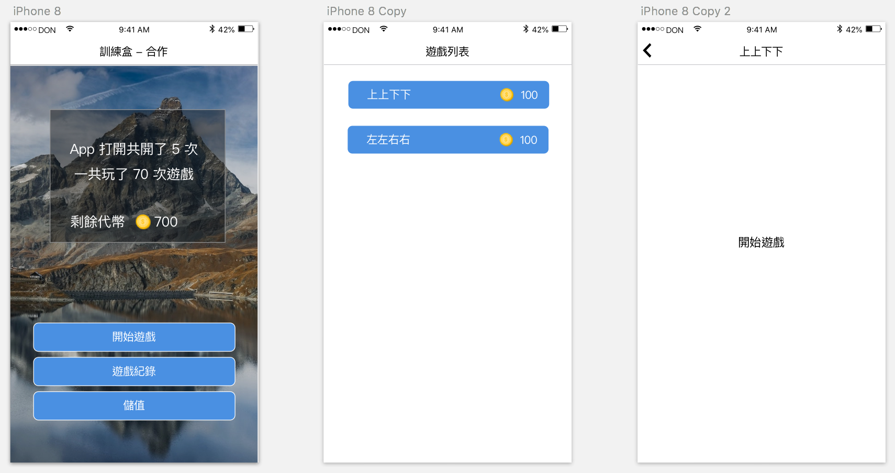
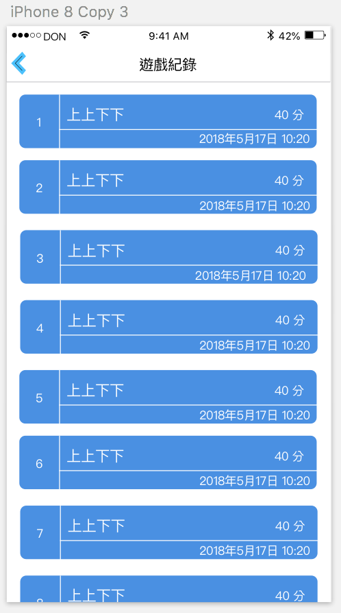
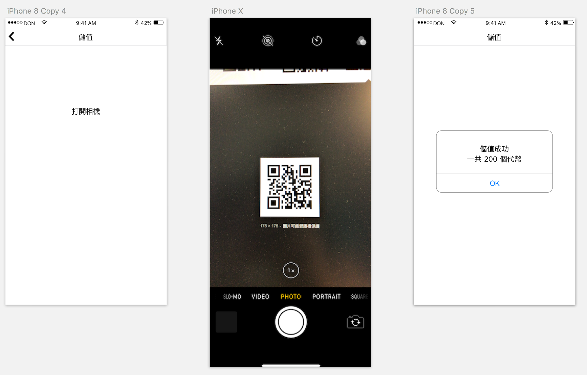

# 訓練盒 - 合作

挑戰日期： 2018年5月17日

Host： Don

Members：Jeremy / Iris / Ells / Gavin / 菘駿 / Morris / Ethan / Sonny

----

## 遊戲規則

8 個人分成以 菘駿 / Gavin 為 Team Leader 的兩個隊伍，組員通過爬樓梯分配。

在挑戰的過程中

完成「任務」中提到的需求表示成功。

- 任務開始時間 9:00 
- 任務截止時間 16:00

### 分組方式

通過爬樓梯分組，分組完成後，需要給小組取名。

### 須知

- 可以互相交換意見但不能直接幫對方寫 Code, 驗收期 Don 會隨機詢問來了解每個人做的事情。
- 如果隊伍討論過程有爭議，由 Team leader 負責拍板。
- 競賽期間不能詢問參與活動以外的人問題，比如 Git.
- **「未完成組」請「完成組」喝星巴克，如果兩隊都完成，Don 請8名挑戰者喝星巴克**。

### 特殊效果

- 如果你的隊伍同時擁有 Sonny / Morris / Ells 其中兩位，你的隊伍截止時間延遲一小時。
- 如果你的隊伍同時擁有 Sonny / Morris / Ells, 獲得重新組隊的機會。

----

## 需求

### 遊戲流程

- 通過主畫面「開始遊戲」可以進到「遊戲列表」。
- 遊戲列表上的遊戲會顯示「遊戲名稱」，玩這個遊戲需要消耗的「代幣數」
- 如果代幣數量不夠，需要跳出提示，「代幣不夠，請儲值」
- 遊戲畫面可以通過「Back」鍵來返回遊戲列表，下一次進入遊戲會是一場新的遊戲。

### 遊戲

- 一個隊伍需要提供兩個遊戲
- 遊戲需要有分數、Timer、重新開始的機制。

----

### 遊戲紀錄

- 顯示過去玩過的遊戲紀錄
- 遊戲紀錄中包括玩的時間、分數

----

### 儲值

- 通過相機掃描 QRCode 進行儲值
- QRCode 的內容會是「appCamp + 數字」這樣的格式，比如「appCamp200」代表儲值200。
- 如果相機中出現的 QRCode 不符合上面的格式，直接忽略即可。
- 如果掃描到指定的格式，則跳回「儲值」介面並跳出成功提示。