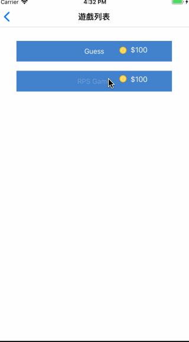
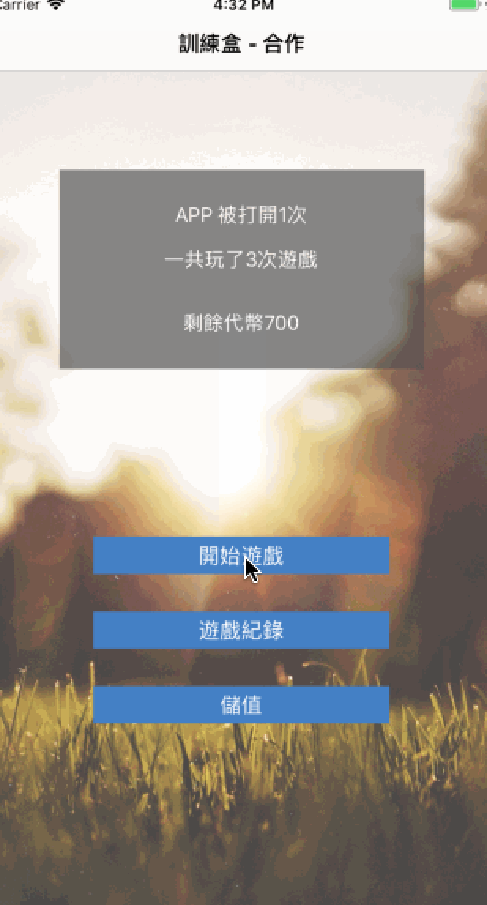

## 訓練盒 - 合作
挑戰日期： 2018年5月17日

隊長 / 隊名 ：Gavin / StarBug

隊員： Jeremy / Ells / Morris 

遊戲名稱： Starbug

---
### 遊戲介紹：

- 遊戲主畫面

    遊戲主畫面會紀錄使用者開啟 APP 的次數以及玩家持有的代幣數量，主畫面有開始遊戲、遊戲紀錄及儲值。

- 開始遊戲

    頁面中會有兩種遊戲選項，每種遊戲必須扣除玩家代幣 100 枚，每次進入遊戲就會扣除 100 ，不限定進入後的遊玩次數。若使用這代幣不足時，程式會跳出警告視窗提醒使用者需要儲值後才能進行遊戲。

- 儲值

    打開畫面後，程式會開啟相機讓使用者掃描 QRCode，掃瞄出的結果若是為 AppCamp 開頭的字串，則進行儲值功能，若字串開頭不為 AppCamp 的話則不進行儲值，也不進行任何動作。

- RPS Game 規則 ( 剪刀石頭布[困難版] )

    每次程式會隨機一個規則判斷這場要玩家是 ”需要輸“ 或者 ”需要贏“，經由判斷之後玩家必須出拳達成所需要的獲勝條件，若失敗三次以上則會挑出重新遊戲的畫面，然後遊戲時間為 30 秒，30秒過後會自動結束遊戲計算玩家分數。

- Guess :
    遊戲有三個，每一次都有20秒的時間來找出有問題的地方
    畫面不一定只有一個答案，但只要答對一個就算過關
    

------

### 遊戲畫面

### 開始 / 結束畫面

