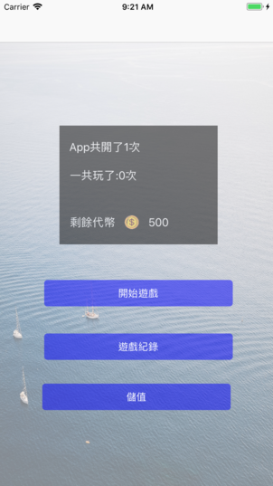
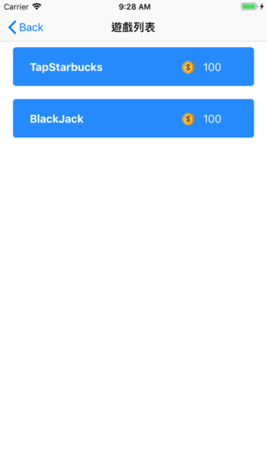
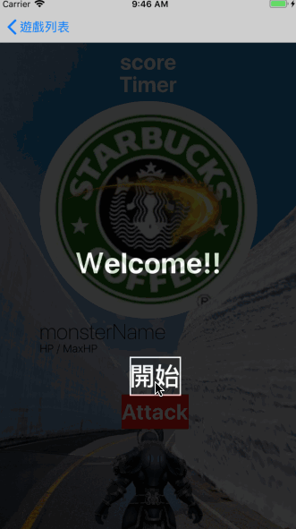
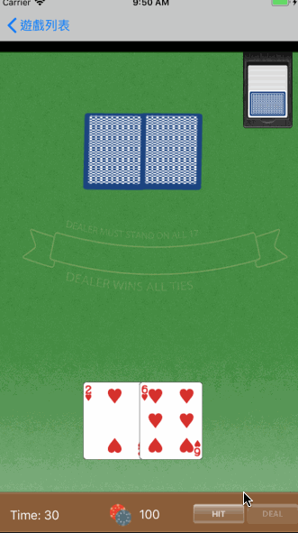
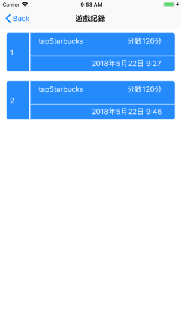
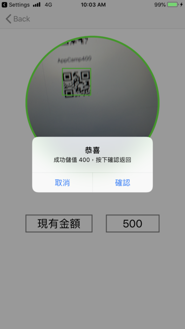

# 訓練盒 - 合作

挑戰日期： 2018年5月17日

隊長： Soj

隊員： Ethan / Sonny / Iris

遊戲名稱： 決戰星巴克

##  APP 介紹

### 主畫面

遊戲主畫面會紀錄使用者開啟 APP 的次數以及玩家持有的代幣數量，主畫面有開始遊戲、遊戲紀錄及儲值。

### 開始遊戲

頁面中會有兩種遊戲選項，每種遊戲必須扣除玩家代幣 100 枚，每次進入遊戲就會扣除 100 ，不限定進入後的遊玩次數。若使用這代幣不足時，程式會跳出警告視窗提醒使用者需要儲值後才能進行遊戲。

### 遊戲介紹

- TapStarbucks：將每回合對手打敗即可得分，對手血量會隨著回合數逐漸變厚。
- BlackJack：利用每次發牌後所獲得的牌，與莊家的牌比大小，倒數結束前所能獲得的籌碼為本場得分。

### 遊戲紀錄

頁面中會記錄每場遊戲的時間以及得分。

### 儲值

打開畫面後，程式會開啟相機讓使用者掃描 QRCode，掃瞄出的結果若是為 AppCamp 開頭的字串，則進行儲值功能，若字串開頭不為 AppCamp 的話則不進行儲值，也不進行任何動作。
